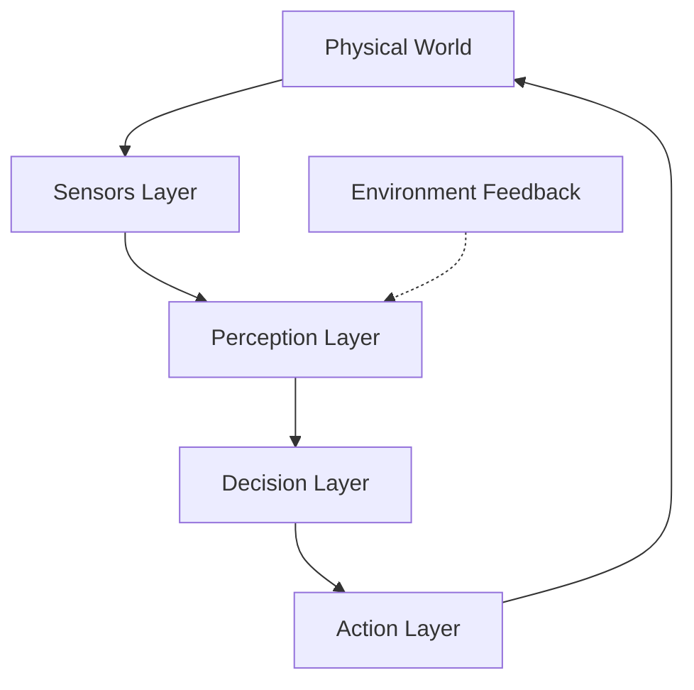

# Chapter 1: Introduction to Physical AI

## Introduction

Imagine a world where artificial intelligence doesn't just process data on screens but physically interacts with the environment—robots that can delicately handle fragile objects, navigate complex terrains, and adapt to real-world uncertainties in real-time. This is the frontier of Physical AI, where digital intelligence meets the tangible world through embodied systems. Unlike traditional AI that operates in virtual spaces, Physical AI systems must understand physics, process sensory data from the real world, and make decisions that directly affect physical outcomes. This chapter introduces you to the fundamental concepts that bridge artificial intelligence and robotics, setting the stage for your journey into building intelligent physical systems.

As you progress through this chapter, you will:
- Understand the core principles that distinguish Physical AI from digital AI
- Learn how Physical AI systems integrate perception, decision-making, and action
- Explore real-world applications that demonstrate the power of embodied intelligence
- Build a simple sensor data collection system to experience Physical AI fundamentals
- Develop the foundational knowledge needed for advanced robotics applications

## What is Physical AI?

Physical AI represents a paradigm shift from traditional artificial intelligence, which primarily processes digital information, to AI systems that are embodied in physical systems and interact directly with the physical world. These systems must understand and operate within the constraints of physics—gravity, momentum, collision, friction—while processing real-time sensory data and making decisions that affect physical outcomes.

The key characteristics that define Physical AI systems include:

**Embodiment in Physical Systems**: Unlike digital AI that exists purely in software, Physical AI systems are embedded in physical bodies with sensors, actuators, and mechanical components. This embodiment creates a direct link between digital computation and physical action.

**Physics Understanding**: Physical AI systems must comprehend and work within the laws of physics. They need to understand how forces affect movement, how objects interact with each other, and how environmental conditions influence their behavior.

**Real-time Sensory Processing**: These systems continuously process data from multiple sensors—cameras, LiDAR, IMUs, force sensors—making decisions based on current environmental conditions rather than pre-stored data.

**Physical Outcome Decision Making**: Every decision made by a Physical AI system has immediate physical consequences, requiring safety considerations and reliability that digital AI systems don't typically need.

**Closed-loop Control**: Physical AI systems operate in closed feedback loops, where actions affect the environment, which in turn affects sensor readings, which influences future actions.

### Physical AI vs Digital AI Comparison

| Aspect | Digital AI | Physical AI |
|--------|------------|-------------|
| Environment | Virtual/Digital | Physical/Real World |
| Constraints | Computational, Memory | Physics, Safety, Hardware |
| Response Time | Often Batch Processing | Real-time/Continuous |
| Feedback Loop | Indirect/Optional | Direct/Required |
| Safety Requirements | Data Integrity | Physical Safety |
| Error Consequences | Information Loss | Physical Damage |

### Real-World Examples

**Warehouse Robots**: Amazon's Kiva robots navigate complex warehouse environments, processing visual and proximity data to transport goods safely and efficiently. These systems must understand spatial relationships, avoid collisions, and adapt to dynamic environments.

**Surgical Robots**: Systems like the da Vinci Surgical Robot combine computer vision, haptic feedback, and precise motor control to assist surgeons in minimally invasive procedures. These robots must operate with extreme precision and safety, processing multiple sensory inputs in real-time.

**Humanoid Robots**: Advanced systems like Boston Dynamics' Atlas or Tesla's Optimus demonstrate sophisticated Physical AI by walking, running, and manipulating objects while maintaining balance and responding to environmental changes.

**Autonomous Vehicles**: Self-driving cars integrate cameras, LiDAR, radar, and GPS to perceive their environment, make navigation decisions, and execute precise control actions while ensuring passenger safety.

## The Physical AI Stack

Physical AI systems operate through a layered architecture that connects hardware sensors to high-level decision-making capabilities. Understanding this stack is crucial for developing effective Physical AI applications.

### Sensors Layer

The foundation of any Physical AI system is its sensor suite, which provides the raw data needed to understand the environment and the system's state. Key sensor categories include:

**Visual Sensors**: Cameras that capture RGB images, depth information, or thermal data. These sensors enable object recognition, navigation, and scene understanding.

**Range Sensors**: LiDAR, radar, and ultrasonic sensors that measure distances to objects in the environment, creating spatial maps and detecting obstacles.

**Inertial Sensors**: IMUs (Inertial Measurement Units) that measure acceleration, angular velocity, and orientation, providing information about the system's motion and position.

**Force/Torque Sensors**: These sensors measure the forces and torques applied to the system, essential for manipulation tasks and maintaining stability.

**Proprioceptive Sensors**: Encoders and other internal sensors that monitor the system's own state, such as joint angles, motor positions, and system health.

### Perception Layer

The perception layer processes raw sensor data to extract meaningful information about the environment and the system's state. This includes:

**Computer Vision**: Algorithms that identify objects, track movement, and understand visual scenes from camera data.

**SLAM (Simultaneous Localization and Mapping)**: Systems that simultaneously build maps of the environment while tracking the robot's position within it.

**State Estimation**: Techniques that combine multiple sensor inputs to estimate the system's current state with greater accuracy than any single sensor could provide.

### Decision Layer

The decision layer takes processed perceptual information and determines appropriate actions. This includes:

**Path Planning**: Algorithms that determine optimal routes through environments while avoiding obstacles and considering dynamic conditions.

**Task Planning**: Higher-level planning that sequences complex behaviors to achieve goals, such as "pick up object A and place it in location B."

**Behavior Selection**: Systems that choose between different behavioral modes based on current conditions and goals.

### Action Layer

The action layer translates decisions into physical movements through:

**Motor Control**: Low-level control systems that command actuators to achieve desired positions, velocities, or forces.

**Manipulation**: Algorithms that control robotic arms and hands to interact with objects in the environment.

**Locomotion**: Systems that control walking, rolling, or flying mechanisms to move the system through space.



### Feedback Loops Connecting All Layers

The Physical AI stack operates through multiple feedback loops that ensure the system adapts to changing conditions:

**Sensor-Perception Loop**: Raw sensor data continuously feeds perception algorithms, which update their understanding as new information becomes available.

**Perception-Decision Loop**: Updated environmental understanding influences decision-making, which may change the system's focus or approach.

**Decision-Action Loop**: Decisions drive actions, which change the system's state and relationship to the environment.

**Action-Sensor Loop**: Actions affect the environment and the system's position, creating new sensor inputs that begin the cycle again.

## Example Code - Simple Sensor Reading

```python
#!/usr/bin/env python3
"""
Basic sensor data reading example
Demonstrates the foundation of Physical AI
"""
import time
import random  # Simulating sensor

class PhysicalAISensor:
    """Simulates a basic sensor for Physical AI system"""

    def __init__(self, sensor_name):
        self.name = sensor_name
        self.data_buffer = []

    def read_sensor(self):
        """Read current sensor value"""
        # In real system, this reads from hardware
        value = random.uniform(0, 100)
        timestamp = time.time()
        return {"value": value, "timestamp": timestamp}

    def collect_data(self, duration=10):
        """Collect sensor data for specified duration"""
        print(f"Collecting data from {self.name}...")

        start_time = time.time()
        while time.time() - start_time < duration:
            data = self.read_sensor()
            self.data_buffer.append(data)
            print(f"  {self.name}: {data['value']:.2f}")
            time.sleep(0.5)

        print(f"Collected {len(self.data_buffer)} samples")
        return self.data_buffer

# Example usage
if __name__ == "__main__":
    distance_sensor = PhysicalAISensor("Distance Sensor")
    data = distance_sensor.collect_data(duration=5)
```

This simple example demonstrates the fundamental concept of sensor data collection that underlies all Physical AI systems. In a real robot, the `read_sensor()` method would interface with actual hardware, but the principle remains the same: continuously gather information from the environment to inform decision-making.

## Challenges in Physical AI

Physical AI systems face unique challenges that don't exist in traditional digital AI applications:

**Real-World Uncertainty**: Unlike controlled digital environments, physical systems must operate in unpredictable environments with variable lighting, surfaces, objects, and conditions. A robot that works perfectly in a lab may struggle in a real-world setting due to factors like changing lighting, unexpected obstacles, or environmental disturbances.

**Safety Requirements**: Physical AI systems can cause real harm if they malfunction. A software bug in a recommendation algorithm might show the wrong product, but a bug in a robot's control system could cause physical damage or injury. This requires rigorous testing, safety protocols, and fail-safe mechanisms.

**Latency Constraints**: Physical systems often operate in real-time, where delays can have immediate consequences. A self-driving car that takes too long to recognize an obstacle may not be able to stop in time, regardless of how accurate its recognition algorithm is.

**Hardware Limitations**: Physical AI systems are constrained by the capabilities of their sensors and actuators. Limited sensor range, actuator precision, and computational power in embedded systems create challenges that don't exist in cloud-based digital AI.

**Sim-to-Real Gap**: Models trained in simulation often don't perform well in the real world due to differences in physics, sensor noise, and environmental conditions. Bridging this gap requires techniques like domain randomization and real-world fine-tuning.

## Hands-On Exercise: Build a Simple Physical AI Data Logger

**Title:** Build a Simple Physical AI Data Logger

**Objective:** Create a Python script that simulates multiple sensors and logs data

**Time:** 45 minutes

### Setup
First, ensure you have the required packages installed:
```bash
pip install numpy matplotlib
```

### Steps

1. **Set up Python environment**: Create a new Python file and import necessary libraries
2. **Create sensor classes**: Implement classes for different sensor types
3. **Implement data logging**: Add functionality to store and save sensor data
4. **Visualize sensor data**: Create plots to visualize the collected data
5. **Add timestamp synchronization**: Ensure all sensor data is properly time-stamped

### Implementation

```python
#!/usr/bin/env python3
"""
Physical AI Data Logger
Simulates multiple sensors and logs data for analysis
"""
import time
import random
import csv
from datetime import datetime
import numpy as np
import matplotlib.pyplot as plt

class Sensor:
    """Base sensor class"""
    def __init__(self, name, units):
        self.name = name
        self.units = units
        self.readings = []

    def read(self):
        """Abstract method for reading sensor data"""
        raise NotImplementedError

class TemperatureSensor(Sensor):
    """Temperature sensor simulation"""
    def __init__(self):
        super().__init__("Temperature", "°C")
        self.base_temp = 22.0

    def read(self):
        # Simulate temperature reading with some noise
        temperature = self.base_temp + random.uniform(-0.5, 0.5)
        timestamp = time.time()
        reading = {"value": temperature, "timestamp": timestamp}
        self.readings.append(reading)
        return reading

class DistanceSensor(Sensor):
    """Distance sensor simulation"""
    def __init__(self):
        super().__init__("Distance", "m")
        self.base_distance = 2.0

    def read(self):
        # Simulate distance reading with variation
        distance = self.base_distance + random.uniform(-0.1, 0.1)
        timestamp = time.time()
        reading = {"value": distance, "timestamp": timestamp}
        self.readings.append(reading)
        return reading

class DataLogger:
    """Manages multiple sensors and logs their data"""
    def __init__(self):
        self.sensors = []
        self.start_time = None

    def add_sensor(self, sensor):
        """Add a sensor to the logger"""
        self.sensors.append(sensor)

    def collect_data(self, duration=10):
        """Collect data from all sensors for specified duration"""
        print("Sensor System Starting...")
        self.start_time = time.time()

        # Collect data for the specified duration
        end_time = self.start_time + duration
        iteration = 0

        while time.time() < end_time:
            for sensor in self.sensors:
                reading = sensor.read()
                elapsed = time.time() - self.start_time
                print(f"[{elapsed:.1f}s] {sensor.name}: {reading['value']:.2f}{sensor.units}")

            time.sleep(0.5)  # 2 Hz sampling rate
            iteration += 1

        print(f"Data collection completed. Collected {iteration} iterations.")

    def save_to_csv(self, filename):
        """Save all sensor data to CSV file"""
        with open(filename, 'w', newline='') as csvfile:
            fieldnames = ['timestamp', 'elapsed_time', 'sensor_name', 'value', 'units']
            writer = csv.DictWriter(csvfile, fieldnames=fieldnames)

            writer.writeheader()
            start_time = self.start_time

            for sensor in self.sensors:
                for reading in sensor.readings:
                    writer.writerow({
                        'timestamp': reading['timestamp'],
                        'elapsed_time': reading['timestamp'] - start_time,
                        'sensor_name': sensor.name,
                        'value': reading['value'],
                        'units': sensor.units
                    })

        print(f"Data logged to {filename}")

    def plot_data(self):
        """Plot sensor data"""
        fig, axes = plt.subplots(len(self.sensors), 1, figsize=(10, 6))
        if len(self.sensors) == 1:
            axes = [axes]

        for i, sensor in enumerate(self.sensors):
            if sensor.readings:
                timestamps = [r['timestamp'] - self.start_time for r in sensor.readings]
                values = [r['value'] for r in sensor.readings]

                axes[i].plot(timestamps, values, label=sensor.name)
                axes[i].set_xlabel('Time (s)')
                axes[i].set_ylabel(f'Value ({sensor.units})')
                axes[i].set_title(f'{sensor.name} Data')
                axes[i].grid(True)

        plt.tight_layout()
        plt.show()

# Example usage
if __name__ == "__main__":
    # Create data logger and add sensors
    logger = DataLogger()
    logger.add_sensor(TemperatureSensor())
    logger.add_sensor(DistanceSensor())

    # Collect data for 10 seconds
    logger.collect_data(duration=10)

    # Save data to CSV
    timestamp = datetime.now().strftime("%Y%m%d_%H%M%S")
    filename = f"physical_ai_log_{timestamp}.csv"
    logger.save_to_csv(filename)

    # Plot the data
    logger.plot_data()
```

### Expected Output
```
Sensor System Starting...
[0.0s] Temperature: 22.3°C
[0.5s] Distance: 1.98m
[1.0s] Temperature: 22.1°C
[1.5s] Distance: 2.02m
...
Data logged to physical_ai_log_20241216_143022.csv
```

### Troubleshooting
- If import errors occur: Run `pip install numpy matplotlib`
- If timing issues occur: Check system clock synchronization
- If matplotlib doesn't display plots: Ensure a display environment is available or save plots to files instead

## Key Takeaways

Physical AI represents a fundamental shift from traditional digital AI by connecting intelligence to the physical world. As you've learned in this chapter:

- Physical AI systems bridge digital intelligence with physical interaction, requiring understanding of both computational algorithms and real-world physics.
- The Physical AI stack consists of interconnected layers—sensors, perception, decision-making, and action—that work together through feedback loops.
- Real-time processing is critical for Physical AI systems, as delays can have immediate physical consequences.
- Safety and reliability are paramount in Physical AI, as these systems can cause real harm if they malfunction.
- The foundation for all robotics systems lies in the integration of sensing, processing, and actuation capabilities.

**Next Chapter Preview:** In Chapter 2, we'll dive deeper into the physical components that make Physical AI possible—sensors and actuators that provide robots with perception and action capabilities. You'll learn about different sensor types, their characteristics, and how to integrate them into working robotic systems.

## Further Reading

- "Probabilistic Robotics" by Thrun, Burgard, and Fox provides comprehensive coverage of the mathematical foundations for robotics
- ROS 2 Official Documentation at docs.ros.org offers practical guidance for implementing Physical AI systems
- NVIDIA Isaac Sim documentation explores simulation environments for Physical AI development
- "Introduction to Autonomous Robots" by Siegwart, Nourbakhsh, and Scaramuzza covers the fundamentals of autonomous systems